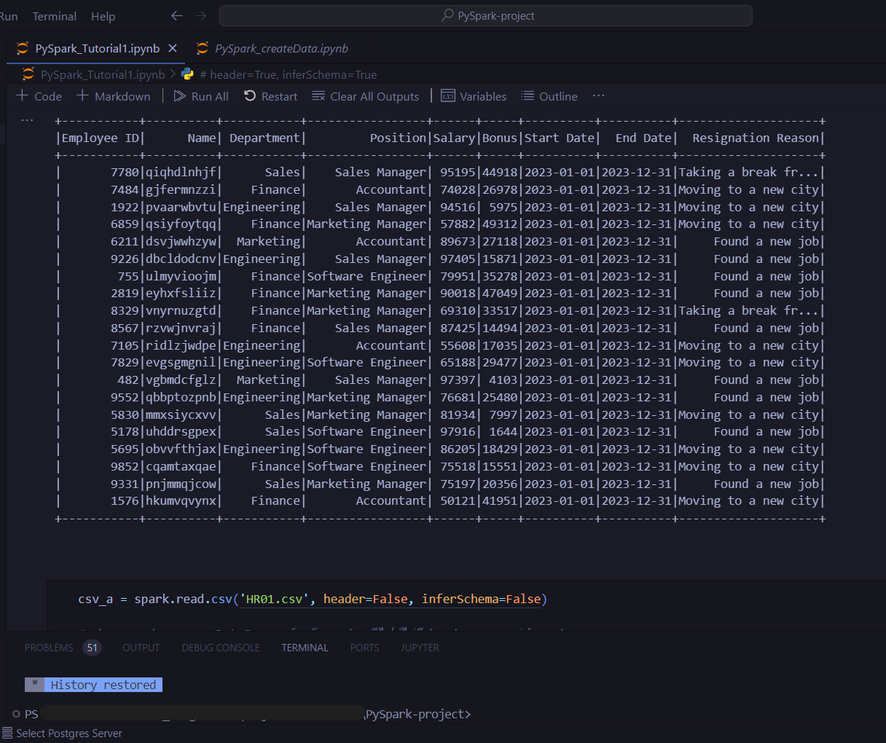

# PySpark-project (Complete)
- Project : PySpark Project
- Tools = Python, PySpark, Pandas
</br>

### Detail : 
- Create File : CSV, TXT.
- Use PySpark and Pandas : manage data.

### Structure :
```
📁 PySpark-project
└── 📁 app
|   └── 📁 tables                           // All CSV Files ( 12 File )
|   └── 📄 use.ipynb                        // Main File ( use manage data )
└── 📁 img
└── 📁 tutorial
|   └── 📄 HR01.csv                         // Use CSV of tutorial
|   └── 📄 Pandas_Tutorial1.ipynb           // Pandas Tutorial
|   └── 📄 PySpark_Tutorial1.ipynb          // PySpark Tutorial
|   └── 📄 Python_Tutorial01.ipynb          // Python Tutorial
|   └── 📄 python_tutorial01.py             // Python Tutorial
|
└── 📄 HR01.csv
└── 📄 hr01.txt
└── 📄 PySpark_createData.ipynb           // Create File
└── 📄 README.md
```

## Run project step : 
- Run use.ipynb
- Run PySpark_Tutorial1.ipynb


 </br></br>

